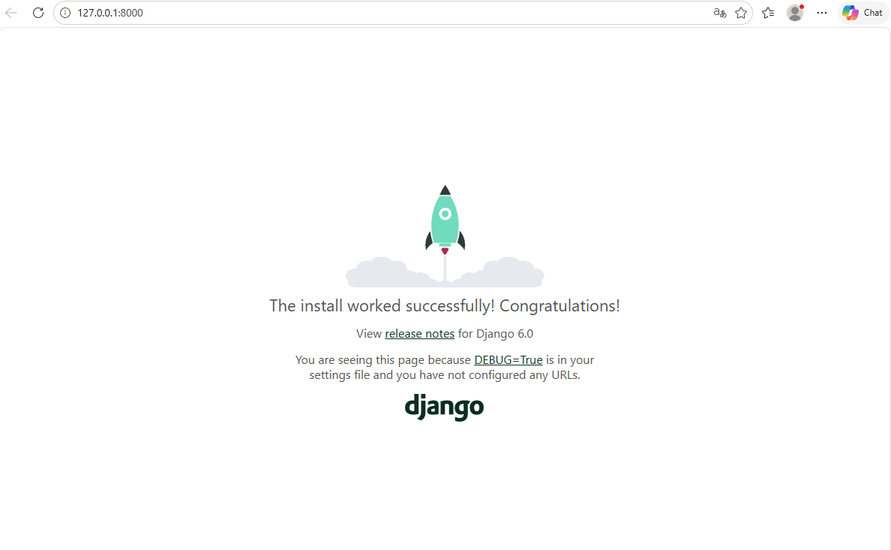
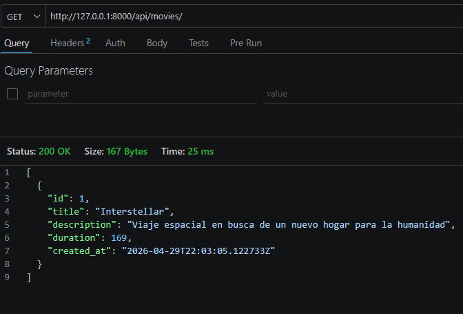
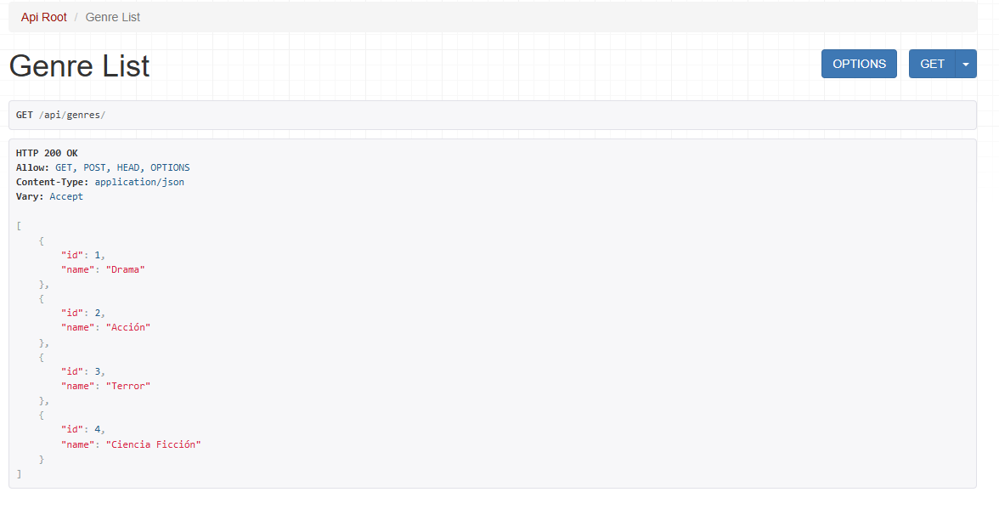
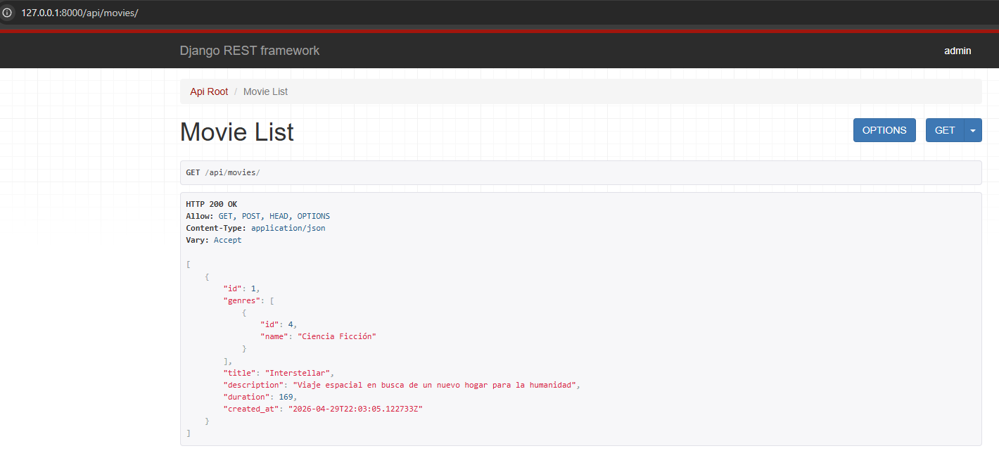

# 🎬 LABORATORIO N07 - CINESPOILERS

API REST desarrollada con Django Rest Framework para la gestión de películas y géneros.

---

## 🚀 PRUEBA 1: Levantar el proyecto

---

## 🎥 PRUEBA 2: Registro de películas (movies)

---

## 🏷️ PRUEBA 3: Creación de géneros (genres)

---

## 🔗 PRUEBA 4: Relación de Movies y Géneros

---

---

## 📌 TECNOLOGÍAS
- Django
- Django REST Framework
- SQLite

---

## 🔗 ENDPOINTS

### Movies
- GET /api/movies/
- POST /api/movies/

### Genres
- GET /api/genres/
- POST /api/genres/

---

## 👨‍💻 Autor
- Pablo